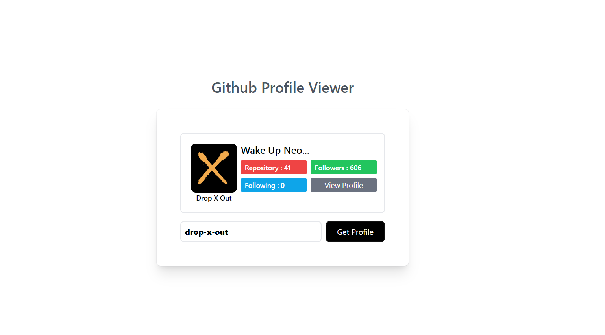
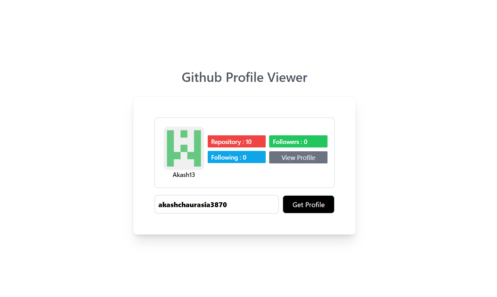

# GitHub Profile Viewer

This project is a GitHub Profile Viewer web application built using **HTML**, **JavaScript**, and **Tailwind CSS**. It leverages the **GitHub API** to search and display detailed information about any GitHub user's profile, including their repositories, followers, following, and more.

## 🌟 Features

- **Search GitHub Profiles:** Enter any GitHub username and retrieve details about the user's profile.
- **User Information Display:** Shows the user's avatar, bio, location, repositories, followers, following, etc.
- **Responsive UI:** Built with Tailwind CSS for a clean and responsive design.
- **GitHub API Integration:** Fetch real-time profile data using the GitHub API.
- **Interactive Elements:** Smooth and user-friendly UI with input fields, search button, and data display.

## 📸 Screenshots


*Example 1*


*Example 2*

## 🛠️ Technologies Used

- **HTML:** For structuring the webpage.
- **JavaScript:** For making API requests and dynamically updating the UI.
- **Tailwind CSS:** For styling and responsive design.
- **GitHub API:** To fetch and display user profiles.

## 🚀 How to Use

1. Clone this repository to your local machine:

   ```bash
   git clone https://github.com/akashchaurasia3870/Github-Profile-viewer.git
